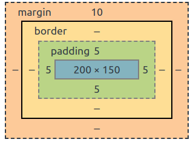

# Snap Challenge: CSS and Flexbox

Complete the following exercises using this HTML and CSS:
```html
<ul class="my-list">
    <li class="my-item">1</li>
    <li class="my-item">2</li>
    <li class="my-item">3</li>
    <li class="my-item">4</li>
    <li class="my-item">5</li>
    <li class="my-item">6</li>
</ul>
```

```css
ul {
  padding: 0;
  margin: 0;
  list-style: none;
}
li {
  background: tomato;
  line-height: 150px;
  color: white;
  font-weight: bold;
  font-size: 3em;
  text-align: center;
}
```
It may help to use [Codepen](https://codepen.io/pen/) for this challenge. Make sure you build out a full HTML page, commit to your snap challenges project, and push as usual when you have each step complete!
1. Add CSS that gives each of these `<li>` the following box model (values in pixels). Change the selectors so that they are using class-specific selectors.





2. What is the total width and height of the element in pixels on the screen for the above box model? Put the answer in html in your document.

3. Using the same CSS that you developed from question 1, write a responsive CSS layout using flexbox that 
* puts all elements on one line if the screen width is wide enough for all elements
* shifts elements to further lines if the screen width is not wide enough for all elements
* spaces elements evenly throughout one line