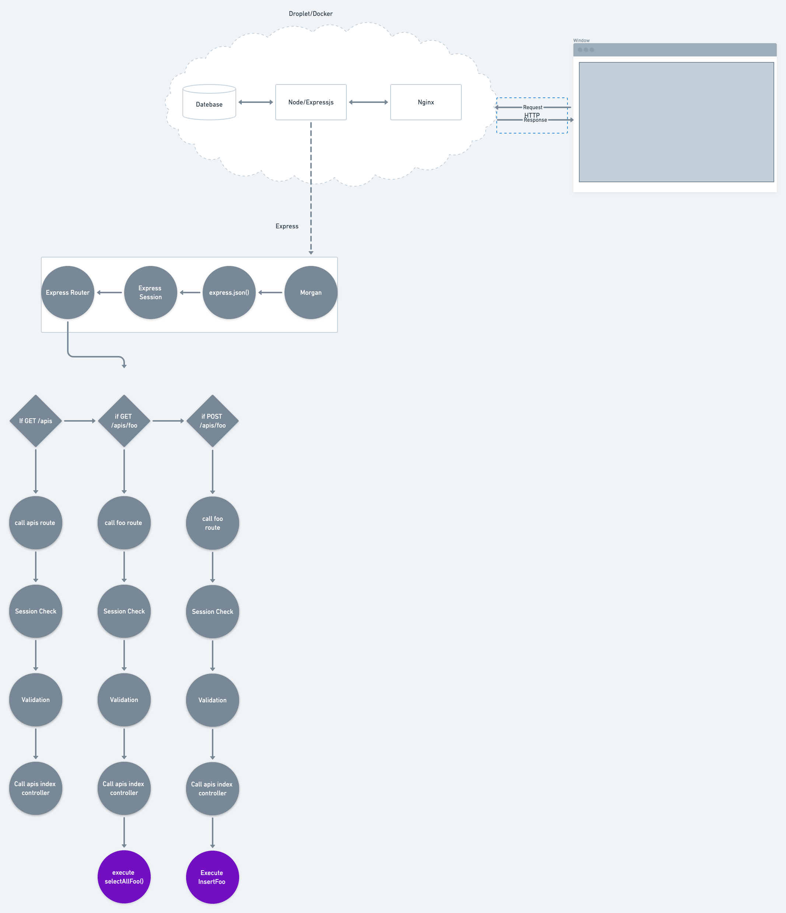

# Advanced Express and Database Functions

## How Express works

* Express is between the database (MySQL) and the webserver (nginx)
* Express translates our data into JSON objects provided by our API
* Step 1: Request -> Session -> Router
    * Passes through Morgan logger
    * Spins up a new express instance to handle the request
* Step 2: Router examines the request, validates session, and calls appropriate function
    * GET request to /apis -> no function, just session validation
    * GET request to /apis/foo -> execute `selectAllFoo()`
    * GET request to /apis/foo/bar -> execute `selectFooByBar()`
    * POST request to /apis/foo -> execute `insertFoo()`

## Database functions
* a.k.a. MySQL Enabled Functions
* These are what call your database
* Almost always named in the format `selectFooByBar()` or `insertFoo()`
    * Foo is the plural of your entity/table name
    * Bar is the Attribute that goes in your MySQL WHERE clause
    * e.g. `selectTweetsByTweetProfileId()`
* Which database functions will you need for each entity Foo?
    * `insertFoo()` - if your users will ever be adding these
    * `updateFoo()` - if your users will be updating information about these
    * `deleteFoo()` - if your users will be removing these
    * `selectFooByBar()` - if any page on your website does the following
        * searches for all Foo that have Bar - example: search tweets by date
        * displays Foo that have Bar - example: display tweets by a single user
* How to figure this out?  Go through your wireframes and figure out which function you will call to get this data
* Occasionally, you will need more advanced functions - if you think you do, ask an instructor

## Code walkthrough
* [Example router](https://github.com/Deep-Dive-Coding-Fullstack-Licensing/example-capstone/blob/development/backend/src/apis/tweet/tweet.route.ts)
* [Example controller](https://github.com/Deep-Dive-Coding-Fullstack-Licensing/example-capstone/blob/development/backend/src/apis/tweet/tweet.controller.ts)
* [Example database function](https://github.com/Deep-Dive-Coding-Fullstack-Licensing/example-capstone/blob/development/backend/src/utils/tweet/selectTweetsByTweetProfileId.ts)

## How to get express on your capstone